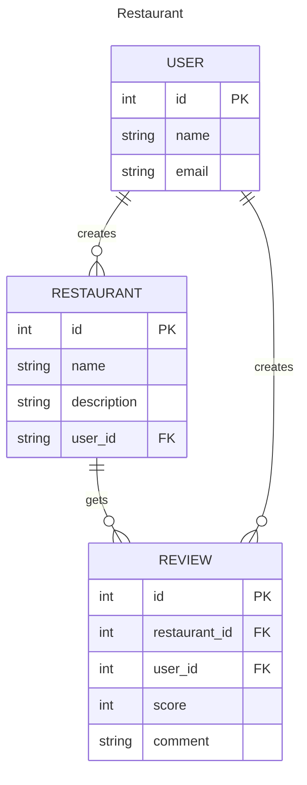

# Restaurant App

A demo for restaurant review system

## Init app

```shell
# clone project, then checkout branch
git clone --branch feature/restaurant https://github.com/chuntangwang/django-demo
# create venv and install package
uv sync

# load venv
source .venv/bin/activate
# create app
django-admin startapp restaurant

# migrate db
python manage.py migrate
# run server
python manage.py runserver
```

## Model Design

