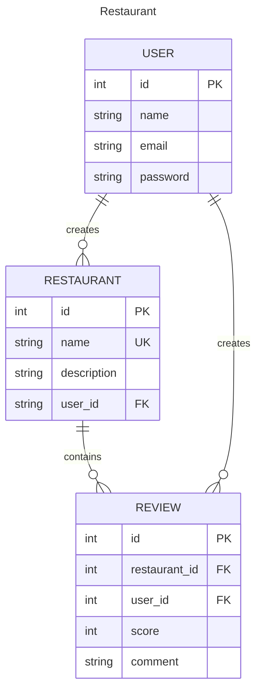

# Restaurant App

A demo for restaurant review system

## Init app

Clone project and install dependencies with [uv](https://github.com/astral-sh/uv)

```shell
# clone project, then checkout branch
git clone --branch feature/restaurant https://github.com/chuntangwang/django-demo
# create venv and install package
uv sync
```

Run project

```shell
# load venv
source .venv/bin/activate

# run server
python manage.py runserver

# using open api with drf-spectacular and swagger ui
python manage.py spectacular --color --file schema.yml
docker run -p 80:8080 -e SWAGGER_JSON=/schema.yml -v ${PWD}/schema.yml:/schema.yml swaggerapi/swagger-ui
```

Open API:
* swagger-ui: http://127.0.0.1:8000/api/schema/swagger-ui/
* redoc: http://127.0.0.1:8000/api/schema/redoc/

Exported Open API html file:
* [redoc-static.html](redoc-static.html)

## Model Design

Database: `db.sqlite3`



## Sample Database: `db.sqlite3`

### Demo account

* superuser
    * `admin` / `admin123456`
* user
    * `user` / `user123456`
    * `foodie` / `foodie123456`

### Create sample data

#### POST /api/v1/register

```json
{
  "username": "user",
  "email": "user@example.com",
  "password": "user123456"
}

{
  "username": "foodie",
  "email": "foodie@example.com",
  "password": "foodie123456"
}
```

#### POST /api/v1/restaurants/

```json
{
  "name": "八方雲集",
  "description": "源於臺灣的跨國台式麵食連鎖店，1998年成立，創辦人林家鈺，以鍋貼、水餃為主力商品。它與四海遊龍並列為台灣鍋貼連鎖店兩強。"
}

{
  "name": "春水堂人文茶館",
  "description": "是一家源自臺灣臺中的連鎖茶館。主要商品為珍珠奶茶及泡沫紅茶等各式調和茶飲，並推廣半發酵茶葉，提倡雙杯式飲法及色香味三段品茗法。是聲稱發明珍珠奶茶的臺灣連鎖餐廳之一，另一家是翰林茶館。"
}

{
  "name": "鼎泰豐",
  "description": "1958年成立，最初為油行，1972年轉為餐廳兼賣小籠包。1996年，鼎泰豐日本新宿店開幕，發展為跨國企業。在1993年曾被《紐約時報》評為“世界十大美食餐廳”之一。2010年香港尖沙咀分店獲得米其林一星，是台灣首間獲《米其林指南》列入星級的餐廳。"
}
```
