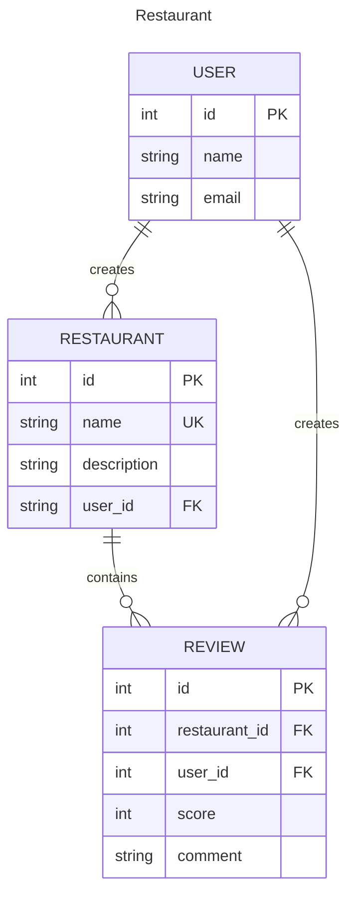

# Restaurant App

A demo for restaurant review system

## Init app

Clone project and install dependencies with [uv](https://github.com/astral-sh/uv)

```shell
# clone project, then checkout branch
git clone --branch feature/restaurant https://github.com/chuntangwang/django-demo
# create venv and install package
uv sync
```

Run project

```shell
# load venv
source .venv/bin/activate

# run server
python manage.py runserver

# using open api with drf-spectacular and swagger ui
$ ./manage.py spectacular --color --file schema.yml
$ docker run -p 80:8080 -e SWAGGER_JSON=/schema.yml -v ${PWD}/schema.yml:/schema.yml swaggerapi/swagger-ui
```

Open API:
* swagger-ui: http://127.0.0.1:8000/api/schema/swagger-ui/
* redoc: http://127.0.0.1:8000/api/schema/redoc/

Exported Open API html file:
* [redoc.html](redoc.html)

## Model Design

Database: `db.sqlite3`



### Demo account

1. Create superuser
```shell
python manage.py createsuperuser
```
2. Create by API `/api/register` for users

`db.sqlite3` contain accounts: (user/password)
* `admin` / `admin123`
